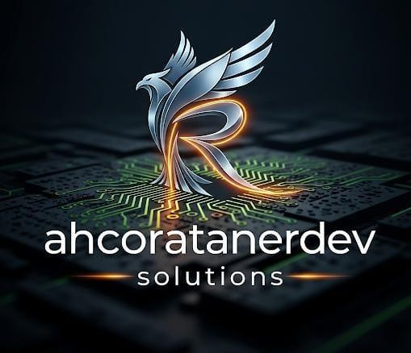
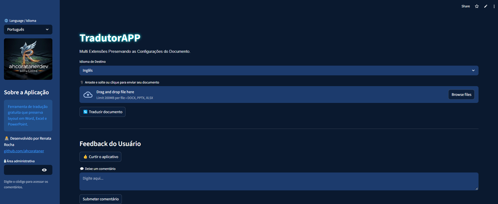

<p align="center">
  
</p>

<h1 align="center">
  TradutorAPP – Tradução de Documentos com Layout Preservado
</h1>

<p align="center">
  Traduza arquivos <code>.docx</code>, <code>.pptx</code> e <code>.xlsx</code> com fidelidade visual, mantendo estilos, tabelas, cabeçalhos e rodapés com um clique.
</p>

<p align="center">
  <a href="https://tradutorapp.streamlit.app">
    
  </a>
  <a href="https://github.com/ahcorataner/translateapp">
    
  </a>
  <a href="https://github.com/ahcorataner/translateapp/blob/main/LICENSE">
    
  </a>
</p>

---

## 📚 Sobre o Projeto

**TradutorAPP** é uma aplicação web desenvolvida por **Renata Rocha** como parte da disciplina **Desenvolvimento de Sistemas Web** do curso de **Engenharia da Computação** da **Universidade Federal do Maranhão (UFMA)** – período 2025.2.

O objetivo é criar uma ferramenta gratuita que utilize **inteligência artificial** para traduzir documentos extensos com precisão, mantendo o layout original e a formatação visual.

---

## ✨ Funcionalidades em Destaque

| Categoria | Funcionalidade | Descrição Detalhada |
| :--- | :--- | :--- |
| 📂 | **Multi-Formato** | Suporte nativo para `.docx`, `.pptx` e `.xlsx`, cobrindo os principais formatos de escritório. |
| 🎨 | **Preservação de Estilo** | Mantém negrito, itálico, cores, fontes, alinhamento, tabelas e estrutura visual. |
| 🔠 | **Capitalização Inteligente** | Reconhece e preserva títulos em caixa alta, mesmo quando estilizados. |
| 🌐 | **Tradução com IA** | Detecta automaticamente o idioma original e traduz com precisão usando inteligência artificial. |
| 📊 | **Barra de Progresso Dinâmica** | Exibe o andamento da tradução em tempo real, mesmo em arquivos grandes. |
| 🚀 | **Suporte a Arquivos de até 200MB** | Muito acima dos limites de tradutores online como Google Tradutor e DeepL. |

---

## 🧠 Inteligência Artificial Aplicada

O TradutorAPP utiliza a API do Google Translate, que é alimentada por modelos de **machine learning neural** treinados para tradução automática. Isso permite:

- Detecção inteligente do idioma original  
- Tradução contextual com preservação de sentido  
- Resultados mais naturais e confiáveis

> Embora o app não treine modelos próprios, ele aplica IA de forma prática para resolver um problema real: traduzir documentos complexos com fidelidade visual.

---

<details>
  <summary><strong>🖼️ Clique para ver a Aplicação em Ação</strong></summary>
  
  <p align="center">
    <br>
    <strong><a href="https://tradutorapp.streamlit.app">➡️ Acessar o Tradutor de Documentos Ao Vivo ⬅️</a></strong>
    <br><br>
    
    <br>
  </p>
</details>

---

## 🛠️ Pilha Tecnológica

<p align="center">
  
  
  
  
  
  
  
</p>

---

## 📥 Como Executar Localmente

```bash
# Clone o repositório
git clone https://github.com/ahcorataner/translateapp.git
cd translateapp

# Instale as dependências
pip install -r requirements.txt

# Execute o app
streamlit run app.py
```

---

## 👩‍💻 Autora

**Renata Rocha**  
📧 Email: renata.rocha@ufma.br  
🔗 GitHub: [@ahcorataner](https://github.com/ahcorataner)  
🆔 Matrícula: 20240001556  
🎓 Universidade Federal do Maranhão – UFMA  
📘 Disciplina: Desenvolvimento de Sistemas Web – 2025.2

---

## 📄 Licença

Este projeto está licenciado sob a Licença MIT. Consulte o arquivo [LICENSE](https://github.com/ahcorataner/translateapp/blob/main/LICENSE) para mais detalhes.
```

---

Se quiser que eu revise o conteúdo final no GitHub depois que subir, é só me chamar. Seu projeto está pronto para impressionar! 💙